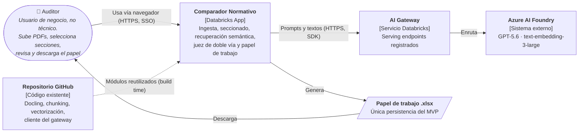
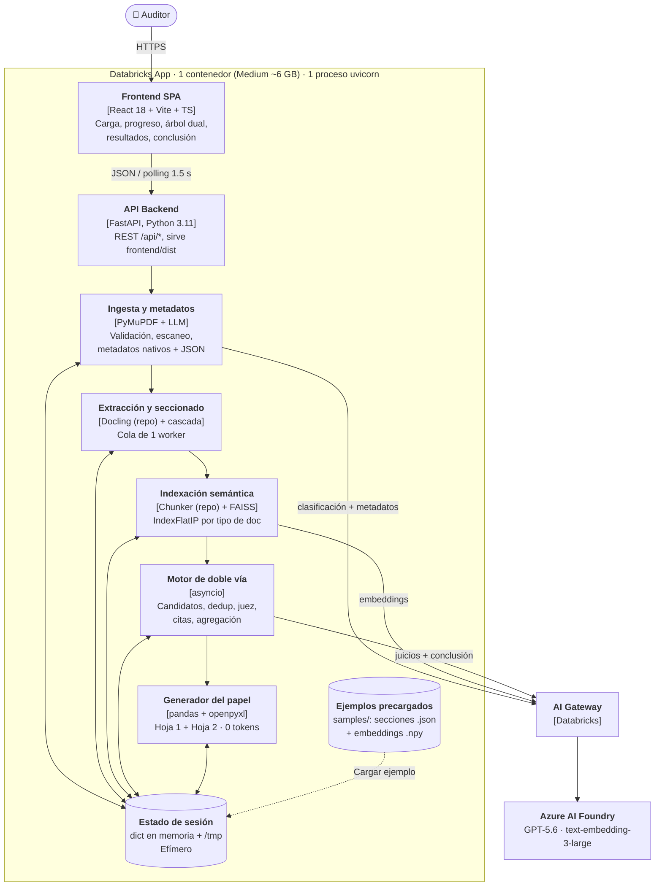

# 03 · Arquitectura

## C4 nivel 1 — Contexto del sistema

Un único actor humano (auditor) usa la App desde el navegador con autenticación de Databricks. En runtime hay una sola dependencia externa: el **AI Gateway de Databricks**, que enruta a **Azure AI Foundry**. El repo de GitHub solo interviene en tiempo de construcción.

## C4 nivel 2 — Contenedores y componentes

Todo corre en **un contenedor** de Databricks Apps. Dos contenedores lógicos (SPA y API) y seis componentes de backend con responsabilidades separadas: en V2, extracción e indexación se mueven a Jobs sin reescribir el resto.

### Componentes

| Componente | Responsabilidad | Tecnología |
|---|---|---|
| Frontend SPA | Carga múltiple, tabla de metadatos, progreso por etapa, árbol dual, resultados, edición de conclusión, descarga | React 18 + Vite + TypeScript, CSS propio, sin librerías de UI pesadas |
| API Backend | Endpoints REST, validaciones, orquestación de jobs, estáticos | FastAPI + uvicorn (1 worker), Pydantic v2 |
| Ingesta y metadatos | Tamaño/páginas, detección de escaneo, metadatos nativos, clasificación + metadatos vía LLM | PyMuPDF, cliente del gateway |
| Extracción y seccionado | Docling y árbol de secciones con texto literal y página | Docling (repo), regex, heurísticas tipográficas |
| Indexación semántica | Sub-chunking, embeddings por lotes, índices FAISS separados | Chunker (repo), faiss-cpu, NumPy |
| Motor de doble vía | Candidatos bidireccionales, pares únicos, juez concurrente, verificación de citas, agregación | asyncio + semáforo, difflib |
| Generador del papel | Hoja 1 y Hoja 2, sin tokens | pandas, openpyxl |
| Estado de sesión | Documentos, secciones, índices, jobs, resultados por sesión | dict en memoria + `/tmp` |

## Flujo extremo a extremo

Pasos 1, 5 y 7: interacción del auditor. Pasos 2, 3, 4 y 6: procesamiento con progreso visible.

## Stack

| Capa | Elección | Notas |
|---|---|---|
| Runtime | Python 3.11 | Compatible con Databricks Apps y el repo |
| API | fastapi, uvicorn, python-multipart, pydantic v2 | Un worker |
| PDF | PyMuPDF (fitz) | Páginas, escaneo, metadatos nativos, texto de primeras páginas |
| Extracción | Docling (versión fijada del repo) | `do_ocr=False`; artefactos pre-cacheados |
| Vectores | faiss-cpu, numpy | IndexFlatIP sobre vectores L2-normalizados = coseno |
| Modelos | Cliente existente del AI Gateway | GPT-5.6; text-embedding-3-large |
| Excel | pandas, openpyxl | Estilos, celdas combinadas, paneles congelados |
| Frontend | React 18, Vite, TypeScript | Se despliega solo `dist` |
| Pruebas | pytest, httpx | Fixtures de seccionado, agregación, citas, Excel |
