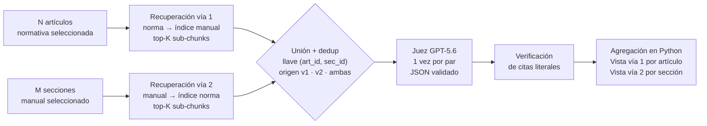

# 09 · Motor de doble vía



## 1. Recuperación de candidatos
```python
K_SUBCHUNKS  = 10    # vecinos por sub-chunk consultado      [CALIBRAR]
SIM_THRESHOLD = 0.30 # similitud coseno mínima               [CALIBRAR]
MIN_FLOOR    = 3     # siempre pasan al menos 3 secciones
MAX_CANDIDATES = 10  # tope de secciones candidatas por origen

def candidatos(seccion_origen, indice_destino) -> list[tuple[str, float]]:
    scores: dict[str, float] = {}
    for sc in subchunks(seccion_origen):
        D, I = indice_destino.search(sc.vec, K_SUBCHUNKS)
        for s, i in zip(D[0], I[0]):
            if i < 0: continue
            sec = indice_destino.mapa[i]
            scores[sec] = max(scores.get(sec, 0.0), float(s))   # colapso: mejor score por sección
    orden = sorted(scores.items(), key=lambda x: -x[1])
    sobre = [x for x in orden if x[1] >= SIM_THRESHOLD][:MAX_CANDIDATES]
    return sobre if len(sobre) >= MIN_FLOOR else orden[:MIN_FLOOR]
```
El **piso** garantiza que ninguna sección desaparezca: si nada supera el umbral, el juez recibe los 3 mejores y declara explícitamente "sin cobertura".

## 2. Pares únicos (deduplicación) — decisión clave de costo
Problema: si el Art. 5 recupera la sección 3.2 y la 3.2 recupera el Art. 5, ingenuamente se juzga dos veces (doble costo y posibles veredictos contradictorios).

Solución: la recuperación en ambas direcciones **solo construye candidatos**; luego se unen, se deduplican por `(articulo_id, seccion_id)` y **cada par se juzga exactamente una vez**.

```python
pares: dict[tuple[str, str], Par] = {}
for art in articulos_sel:                                   # vía 1
    for sec, s in candidatos(art, idx_manual):
        p = pares.setdefault((art.id, sec), Par(art.id, sec))
        p.score_v1, p.rank_v1 = s, rank; p.origen.add("v1")
for sec in secciones_sel:                                   # vía 2
    for art, s in candidatos(sec, idx_norma):
        p = pares.setdefault((art, sec.id), Par(art, sec.id))
        p.score_v2, p.rank_v2 = s, rank; p.origen.add("v2")
# p.score_max = max(score_v1, score_v2)
# log: n_pares_ingenuo vs n_pares_unicos
```
Las vías reaparecen **solo al reportar**: vía 1 = agrupar pares por artículo; vía 2 = agrupar los mismos pares por sección. Mismo veredicto, dos vistas, sin reconciliación. 50 × 40 secciones: ~900 juicios ingenuos → típicamente la mitad o menos.

## 3. Juez auditor normativo
- Prompt: [`backend/prompts/juez.md`](../backend/prompts/juez.md).
- Entrada por par: texto literal **completo** del artículo y de la sección del manual + rutas jerárquicas + nombres de documento.
- Concurrencia `asyncio` con semáforo `LLM_CONCURRENCY` (6). Progreso: "Par 128 de 412".

```python
class Veredicto(BaseModel):
    naturaleza_articulo: Literal["obligacion", "informativo", "no_aplica_entidad"]
    cobertura: Literal["total", "parcial", "nula"]
    cita_norma: str
    cita_manual: str | None
    comentario: str
    elementos_faltantes: list[str] = []
    confianza: float = Field(ge=0, le=1)

class Par(BaseModel):
    id: str
    articulo_id: str
    seccion_id: str
    origen: set[Literal["v1", "v2"]]
    score_v1: float | None = None; rank_v1: int | None = None
    score_v2: float | None = None; rank_v2: int | None = None
    veredicto: Veredicto | None = None
    cita_norma_verificada: bool = False
    cita_manual_verificada: bool = False
    requiere_revision: bool = False
```

## 4. Validación de la respuesta
1. Validar con Pydantic. JSON inválido → 1 reintento con el error adjunto → si persiste: `requiere_revision=True`, listado en el anexo.
2. **Verificación de citas** (cada cita contra su texto fuente):
   - normalizar espacios y saltos de línea; comprobar subcadena exacta → verificada.
   - si no: buscar el fragmento más parecido con `difflib.SequenceMatcher` sobre ventanas del texto fuente; si ratio ≥ `CITATION_FUZZY_MIN` (0.90) → **reemplazar por el fragmento real** y marcar verificada.
   - si no y ratio ≥ `CITATION_SHOW_MIN` (0.75): `cita_*_verificada=False`, `requiere_revision=True`; el papel muestra el fragmento real más cercano con aviso.
   - si ratio < 0.75: `cita_*_verificada=False`, `requiere_revision=True`; celda vacía con aviso.
3. El texto que llega al Excel **siempre** proviene del documento fuente, nunca del modelo.

## 5. Agregación de marcas (Python, sin tokens)
Marcas del banco: **A** sí cumple · **L** parcialmente · **R** no cumple · **X** no aplica · **P** información obtenida de la normativa.
La marca es propiedad del **artículo** (fila del papel), derivada de sus pares:

```python
def marca_articulo(pares: list[Par]) -> tuple[str, list[Par]]:
    validos = [p for p in pares if p.veredicto]
    nat = moda([p.veredicto.naturaleza_articulo for p in validos], empate="obligacion")
    if nat == "informativo":       return "P", []
    if nat == "no_aplica_entidad": return "X", []
    tot = sorted([p for p in validos if p.veredicto.cobertura == "total"],  key=conf_desc)
    par = sorted([p for p in validos if p.veredicto.cobertura == "parcial"], key=conf_desc)
    if tot: return "A", tot[:1]          # respaldo: par total de mayor confianza
    if par: return "L", par[:1]          # respaldo: 1 sección (decisión 14 #5)
    return "R", sorted(validos, key=score_desc)[:1]   # comentario explica la brecha

# `secciones_sel` son solo las secciones INCLUIDAS (las excluidas como no comparables no son controles sin base: van aparte, con su motivo, en el anexo).
def controles_sin_base(secciones_sel, pares) -> list[str]:
    # Vía 2: sección del manual sin ningún par con cobertura total/parcial
    # sobre un artículo de naturaleza "obligacion".
```

> **Limitación conocida del MVP.** Dos coberturas parciales en secciones distintas podrían sumar cobertura total. En el MVP se reporta **L** con la sección parcial de mayor confianza (las demás quedan en el anexo); la evaluación conjunta queda para V2.
